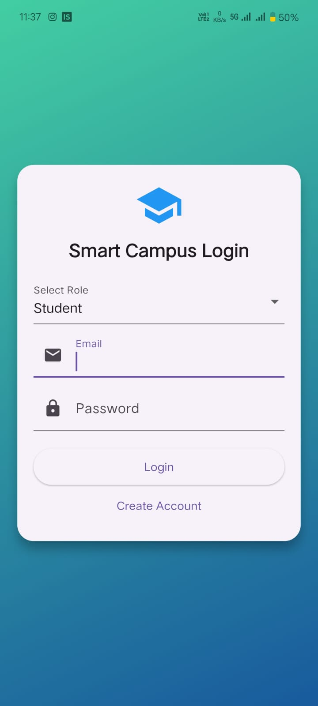
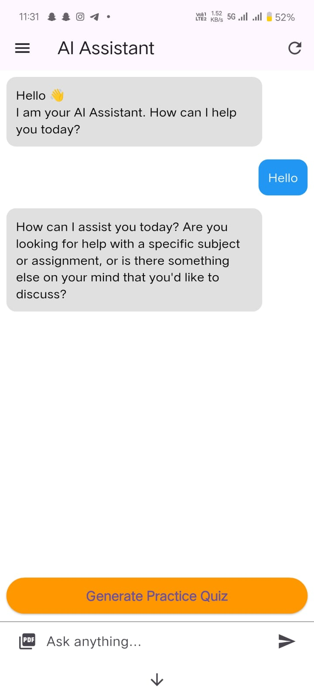

# Smart Campus AI Platform
### An AI-Powered Mobile Application for Smarter Campus Life

Smart Campus AI Platform is a modern mobile application designed to simplify and improve campus life for students and faculty. Built using **Flutter**, **Firebase**, and **AI-powered services**, the platform brings together essential campus features such as academic assistance, campus navigation, emergency support, event updates, lost & found services, career guidance, and mental wellness support into one unified application.

---

## Overview

Educational institutions are rapidly moving toward digital transformation, but many campus services still remain fragmented across different systems or manual processes. This project addresses that challenge by providing a **single smart mobile platform** that centralizes key student-focused services.

The Smart Campus AI Platform is designed to enhance:

- **Student productivity**
- **Campus accessibility**
- **Academic support**
- **Safety and communication**
- **Student engagement and well-being**

The application aims to deliver a smooth and intelligent user experience through an integrated and user-friendly interface.

---

## Key Features

- Secure **Login & Registration**
- Personalized **Student Profile Management**
- AI-based **Study Assistant**
- Interactive **Campus Navigation**
- Real-time **Event Notifications**
- **Emergency Alert System**
- **Lost & Found Management**
- **Career Guidance Support**
- **Mental Health Support**
- Cloud-based backend using **Firebase**
- Cross-platform mobile development using **Flutter**

---

## Core Modules

### 1. Authentication Module
Provides secure user authentication for students and faculty using login and registration functionality.

### 2. Student Profile Module
Allows users to manage and view personal profile details within the platform.

### 3. AI Study Assistant
Helps students with academic queries, learning support, and intelligent guidance through AI integration.

### 4. Campus Navigation Module
Assists users in locating important campus buildings, facilities, and services.

### 5. Event Management Module
Displays campus events, announcements, and activity updates in one place.

### 6. Emergency Alert Module
Enables quick access to emergency help and important safety notifications.

### 7. Lost & Found Module
Allows users to report, view, and track lost or found items on campus.

### 8. Career Guidance Module
Supports students with career-related information, opportunities, and future planning.

### 9. Mental Health Support Module
Provides a supportive section focused on student wellness and mental well-being.

---

## Tech Stack

### Frontend
- Flutter
- Dart

### Backend / Database
- Firebase Authentication
- Cloud Firestore
- Firebase Storage

### AI Integration
- Groq API / AI-powered services

### Development Tools
- Android Studio
- VS Code
- Git
- GitHub

---

## Project Structure

```bash
Smart-Campus-AI-Platform/
│── android/
│── ios/
│── lib/
│── web/
│── windows/
│── linux/
│── macos/
│── test/
│── pubspec.yaml
│── README.md
```

---

## Screenshots

Add your best project screenshots in this section.

Suggested screenshots:
- Login Screen
- Home Dashboard
- AI Study Assistant
- Campus Navigation
- Event Module
- Emergency Alert Module

Example:

```md
## Screenshots

### Login Screen


### Dashboard


### AI Study Assistant

```


## Installation and Setup

### 1. Clone the Repository
```bash
git clone https://github.com/tharuni2503/Smart-Campus-AI-Platform.git
```

### 2. Navigate to the Project Folder
```bash
cd Smart-Campus-AI-Platform
```

### 3. Install Dependencies
```bash
flutter pub get
```

### 4. Run the Application
```bash
flutter run
```

---

## Requirements

Make sure the following tools are installed before running the project:

- Flutter SDK
- Dart SDK
- Android Studio or VS Code
- Firebase Project Configuration
- Internet connection for API-based features

---

## Purpose of the Project

The primary objective of this project is to create an **intelligent campus ecosystem** that supports students not only academically, but also socially, emotionally, and safely.

This platform was developed to demonstrate how **Artificial Intelligence**, **Mobile Application Development**, and **Cloud Technologies** can be combined to build a practical real-world campus solution.

---

## Future Enhancements

The project can be extended in the future with additional smart features such as:

- AI chatbot with voice interaction
- Smart attendance system
- Real-time campus bus tracking
- QR-based student services
- Smart timetable integration
- Notification personalization
- Student discussion/community forum
- Advanced analytics dashboard for administrators

---

## Research Contribution

This project highlights the role of AI and mobile computing in transforming traditional campus systems into a more connected and student-centric digital environment.

It contributes to the idea of a **smart educational ecosystem** by integrating multiple student services into a single mobile application.

---

## Author

**Tharuni**  
B.Tech Project – Smart Campus AI Platform

> If you have team members, you can add their names here as well.

---

## License

This project is developed for **academic and educational purposes only**.

---

## Repository Link

GitHub Repository:  
[https://github.com/tharuni2503/Smart-Campus-AI-Platform](https://github.com/tharuni2503/Smart-Campus-AI-Platform)

---

## Final Note

This project reflects the concept of a **Smart Campus** by combining technology, AI, and mobile accessibility to improve the student campus experience in a meaningful and practical way.
